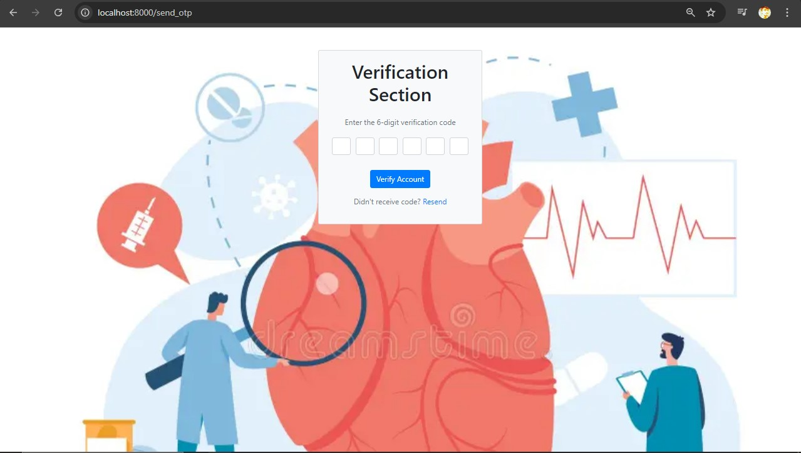

Here’s a draft for a creative and visually appealing `README.md` for your Django heart disease analysis project:

---

# Heart Disease Analysis and Prediction

Welcome to the Heart Disease Analysis and Prediction project! This Django-based web application leverages machine learning to analyze and predict the likelihood of heart disease based on user input. The project provides an intuitive interface for users to understand their heart health and make informed decisions.

## 🖼️ Screenshots

Here are some snapshots of the application:

- **Home Page:** 
  

- **Login Page:**
  

- **Signup Page:**
  

- **Verification Page:**
  

- **Confusion Matrix:**
  

- **Feature Importance:**
  

- **Model Architecture:**
  

## 🚀 Features

- **User Authentication:** Secure login, signup, and verification processes.
- **Heart Disease Prediction:** Analyze user data and predict heart disease risk using a trained machine learning model.
- **Visualization:** View important features and model performance metrics.
- **Interactive Dashboard:** User-friendly interface for easy interaction and understanding.

## 💻 Installation

To get this project up and running on your local machine, follow these steps:

1. **Clone the repository:**

    ```bash
    git clone https://github.com/Ram-Devopss/Django-Heartdiease-Analysis.git
    ```

2. **Navigate to the project directory:**

    ```bash
    cd heart_disease_analysis
    ```

3. **Create a virtual environment and activate it:**

    ```bash
    python -m venv env
    source env/bin/activate  # On Windows use `env\Scripts\activate`
    ```

4. **Install the required packages:**

    ```bash
    pip install -r requirements.txt
    ```

5. **Apply migrations:**

    ```bash
    python manage.py migrate
    ```

6. **Run the server:**

    ```bash
    python manage.py runserver
    ```

7. **Access the application:**

    Open your browser and go to `http://127.0.0.1:8000/`.

## 🔧 Usage

1. **Register:** Create a new account and log in.
2. **Input Data:** Enter the required health parameters.
3. **Analyze:** View the prediction and associated insights.
4. **Visualize:** Explore various visualizations of the model's performance and important features.

## 📈 Model Details

The heart disease prediction model is built using state-of-the-art machine learning techniques. It has been trained on extensive datasets to provide accurate predictions. Key components include:

- **Feature Analysis:** Identifying the most influential factors for prediction.
- **Performance Metrics:** Evaluating model performance through metrics such as accuracy, precision, recall, and the confusion matrix.

## 🤝 Contributing

Contributions are welcome! If you have suggestions or improvements, please submit a pull request or open an issue.

## 📧 Contact

If you encounter any issues or have questions, feel free to reach out to me at [ramdevops2005@gmail.com](mailto:ramdevops2005@gmail.com).

---

Feel free to adjust the details as necessary and add any additional sections that might be relevant to your project.
